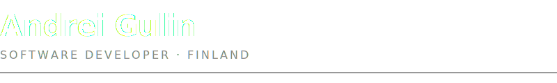

<picture>
  <source media="(prefers-color-scheme: dark)" srcset="header-dark.svg">
  <source media="(prefers-color-scheme: light)" srcset="header-light.svg">
  
</picture>

 

  

  

<!-- ═══════════════════════════════════════════ -->

<h3>
&nbsp;&nbsp;P U B L I S H E D &nbsp; A P P S
</h3>

<table>
<tr>
<td width="50%" valign="top">

<h4><a href="https://andebugulin.github.io/nfcGuard/">nfcGuard — NFC Focus Lock</a></h4>

Block distracting apps and unlock them only by tapping a physical NFC tag. Scheduled blocking modes, persistent service, emergency recovery.

`Kotlin` `Jetpack Compose` `NFC` `Foreground Services`

</td>
<td width="50%" valign="top">

<h4><a href="https://andebugulin.github.io/Awareen/">Awareen — Screen Time Overlay</a></h4>

Persistent on-screen timer showing daily screen time across all apps. Three-level color alerts, fully customizable. **50+ organic users.**

`Kotlin` `Overlay Services` `Background Execution`

</td>
</tr>
</table>

<!-- ═══════════════════════════════════════════ -->

<h3>
&nbsp;&nbsp;P R O J E C T S
</h3>

<table>
<tr>
<td width="33%" valign="top">

<h4><a href="https://kn-owl-edge-tree.vercel.app">kn-owl-edge-tree</a></h4>

Zettelkasten note graph with WebGL visualization.

`Next.js` `tRPC` `PostgreSQL` `Sigma.js`

</td>
<td width="33%" valign="top">

<h4><a href="https://github.com/Andebugulin/wordor">Wordor</a></h4>

Translator with spaced repetition and AI-powered hints.

`Flutter` `DeepL API` `Gemini API` `Drift`

</td>
<td width="33%" valign="top">

<h4><a href="https://t.me/morner_bot">Morner</a></h4>

Morning routine Telegram bot. **50+ daily users.**

`Python` `aiogram` `Oracle Cloud`

</td>
</tr>
<tr>
<td width="33%" valign="top">

<h4><a href="https://galeriyah.netlify.app/">GaleriYah</a></h4>

Photography portfolio with admin panel and Flickr pipeline.

`Next.js` `Supabase` `Framer Motion`

</td>
<td width="33%" valign="top"></td>
<td width="33%" valign="top"></td>
</tr>
</table>

<!-- ═══════════════════════════════════════════ -->

<h3>
&nbsp;&nbsp;S T A C K
</h3>

<!-- ═══════════════════════════════════════════ -->

<h3>
&nbsp;&nbsp;B A C K G R O U N D
</h3>

<table width="100%">
<tr>
<td align="left"><strong>B.Eng Information Technology</strong></td>
<td align="right">XAMK, Finland (2025) · GPA <strong>4.47</strong>/5.0</td>
</tr>
<tr>
<td align="left"><strong>Thesis:</strong> <a href="https://andebugulin.github.io/thesis/">JS vs WebAssembly Performance Visualization</a></td>
<td align="right">2025</td>
</tr>
<tr>
<td align="left"><strong>Certifications</strong></td>
<td align="right">AWS Cloud Foundations · DeepLearning.AI · Cisco Network Security</td>
</tr>
</table>

---

All projects are open source · No ads · No tracking · Privacy first
